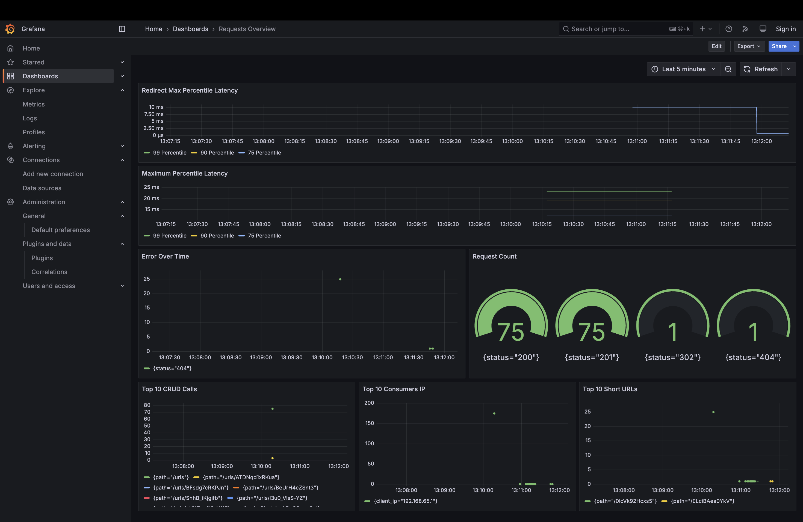

# URL Shortener
A simple REST API to shorten urls. 

# Features

## Core Functionality

* **Fast URL Shortening:** Quickly create short, shareable links.
* **Reliable Redirection:** Seamlessly redirects to the original URL.
* **Click Tracking:** Monitor link performance with detailed access statistics.
* **Easy API Integration:**  Integrate URL shortening into your apps using a simple REST API.

## Monitoring & Logging

### **Real-time Insights:**  Monitor key metrics and logs with Grafana.
* **Redirect Max Percentile Latency:** Tracks 99th, 90th, and 75th percentile latency for redirects.  
* **Maximum Percentile Latency:** Displays highest recorded latencies over time.  
* **Error Rate Over Time:** Tracks occurrences of `4xx` errors.  
* **Request Count (Gauge):** Shows count of requests segmented by status codes (`200`, `201`, `302`, `404`).  
* **Top 10 CRUD Calls:** Lists the most frequently accessed API endpoints.  
* **Top 10 Consumers (Client IPs):** Shows top IPs making the most requests.  
* **Top 10 Short URLs:** Tracks the most accessed short URLs.  


## [Grafana Link](http://localhost:3000)

# Architechture


## Decisions and Tradeoffs
* **NanoID** allowes low [probability of collision](https://en.wikipedia.org/wiki/Birthday_problem), allowing me to generate unique short URLs without checking the database. Using a [12 character length NanoID](https://alex7kom.github.io/nano-nanoid-cc/?alphabet=_-0123456789ABCDEFGHIJKLMNOPQRSTUVWXYZabcdefghijklmnopqrstuvwxyz&size=12&speed=25&speedUnit=second)
* A **3:1 read-to-write** ratio is assumed, prioritizing fast reads.
* POST requests are slower due to validation and uniqueness checks.
* **Redis** is checked first to optimize GET requests and reduce database load.
* Assuming the usage in for internal purpose. Considering the reads to be 50RPS.
* **PostgreSQL** is used for persistent storage of urls.
* **Docker** is used for a consistent local development setup.
* **Availability and Partition Tolerance (AP)** is prioritized based on CAP theorem.
* **Using 302 redirect** for keeping track of statistics. 301 would result in caching on client side and thus inconsistent statistics.
* **CRON** job is used to clean up expired urls. It runs every 5 minutes.

## Future Scope
* When deployed in scale sharding the database can be considered. 
* Rate limiting should be considered to prevent DDoS attacks. 
* In case expected throughput is more than 100RPS, **Cassandra** can be used.
* For statistics, currently I am using the same PostgreSQL database, but it can become a bottleneck at high usage. 

## Alternatives
* Counter Approach - Adding a counter to maintain uniqueness. Compromises security due to predictability.
* Base62 Encoding/Hashing - Using a prefix if a hash or base62 encoding is similar to the NanoID approach as the probability of collision depends again on the Birthday problem. However, NanoId provides simplicity.

# Steps to run

1. Modify create .env file similar to template.env and config.json file similar to template.config.json
2. Make sure to replace **DATABASE_HOST, DATABASE_PORT, DATABASE_NAME, DATABASE_USER, DATABASE_PASSWORD** accordingly. **Keep Database credentials consistent in .env and config.json**
3. Run using docker compose
```
docker compose build docker compose up -d
```
# Development Steps
1. Initialize Go Project
```
go mod init url-shortener go mod tidy

```
2. Generate Server Interface From oapi-codegen
```
oapi-codegen --config=api/server.cfg.yaml api/openapi.yaml oapi-codegen --config=api/types.cfg.yaml api/openapi.yaml
```
3. Implement Initial
4. Add Docker & Postgresql
5. Complete Implementation

# Learnings
* Developed skills in using Docker Compose for managing the development environment.
* Explored Grafana for monitoring and visualizing key metrics.
* Gained insights into architectural considerations for handling high throughput and availability.
* Learned about trade-offs between different approaches for URL shortening (e.g., counter approach vs. NanoID).
* Enhanced understanding of CAP theorem and its implications for system design.
* Gained experience in provisioning and persistent storage of Grafana dashboards.
* Learned about PlantUML for generating diagrams.