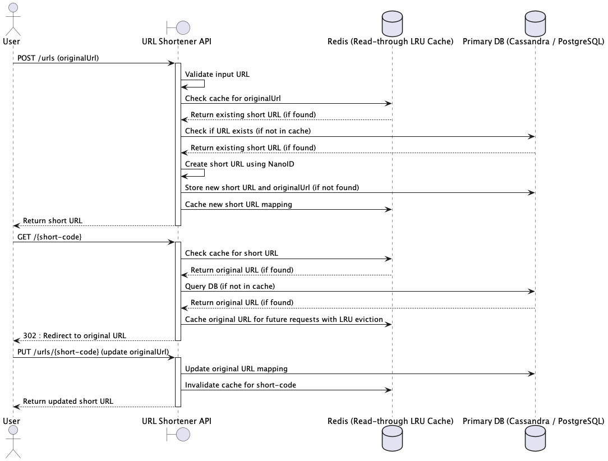

# URL Shortener
A simple REST API to shorten urls. 

# Architechture

## Decisions and Tradeoffs
* **NanoID** allowes low [probability of collision](https://en.wikipedia.org/wiki/Birthday_problem), allowing me to generate unique short URLs without checking the database. Using a [12 character length NanoID](https://alex7kom.github.io/nano-nanoid-cc/?alphabet=_-0123456789ABCDEFGHIJKLMNOPQRSTUVWXYZabcdefghijklmnopqrstuvwxyz&size=12&speed=25&speedUnit=second)
* A **3:1 read-to-write** ratio is assumed, prioritizing fast reads.
* POST requests are slower due to validation and uniqueness checks.
* **Redis** is checked first to optimize GET requests and reduce database load.
* Assuming the usage in for internal purpose. Considering the reads to be 50RPS.
* **PostgreSQL** is used for persistent storage of urls.
* **Docker** is used for a consistent local development setup.
* **Availability and Partition Tolerance (AP)** is prioritized based on CAP theorem.
* **Using 302 redirect** for keeping track of statistics. 301 would result in caching on client side and thus inconsistent statistics.

## Future Scope
* When deployed in scale sharding the database can be considered. 
* Rate limiting should be considered to prevent DDoS attacks. 
* In case expected throughput is more than 100RPS, **Cassandra** can be used.

## Alternatives
* Counter Approach - Adding a counter to maintain uniqueness. Compromises security due to predictability.
* Base62 Encoding/Hashing - Using a prefix if a hash or base62 encoding is similar to the NanoID approach as the probability of collision depends again on the Birthday problem. However, NanoId provides simplicity.